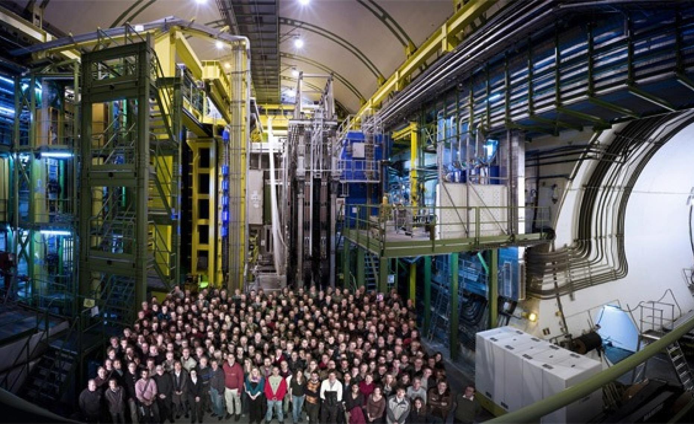

class: middle, center, title-slide

# Open Brains for Hire

.footnote[Tim Head, Wild Tree Tech, OpenCon CH 2018]

---

# Hi there 👋!

.center.width-100[]

Previously: CERN and EPFL. Now Wild Tree Tech.

.footnote[Image credit: The LHCb collaboration]

???

* used to work at CERN and EPFL
* science needs great tools
* industry needs great tools
* collaborate with and redefine open-source tools
* work with both!
* created Wild Tree Tech GmbH

---
# Outline
.larger[
* concrete example https://mybinder.org
* discussion points
  * free labour
  * governance
  * capturing value
  * evil uses of a project

]
---
class: middle, center

# MyBinder.org: Open public infrastructure to share computational research

???

Sharing research is hard work, we want to make it easier

---

class: middle, center

# Reproduce work with a click

.larger[
http://bit.ly/oc-bern
]

---
# mybinder.org

.larger[
Public infrastructure that lets anyone run any code for free and with only one
click.

Motivated by education and making research easier to reproduce.

.center[🚀 70000 launches per week,  🎉 1400000 launches since 1 January 2018]

Core team of around five part timers, spread over two continents.

]

---

class: middle, center

# Why does this work?

---

class: middle, center

# Radically open collaboration

---

# (Nearly) No Secrets

* number of users
* service outages
* strategy discussions
* running cost
* configuration
* status of the system
* meetings

All openly available.

For some we haven't automated the data export yet,
so you need to ask for the latest figures (or help us automate it 😄).

Only secret is what hostnames we block against cryptominers.

---
# Trust

???

Trust

---

class: middle, center

# Discussion points

---

# Great, all this free labour!

* No, otherwise only those who can afford to work for free will contribute
* People who work for free will work on something else
* Provide balance against paid contributors financed by external parties

---

# Governance

* How to govern a project that has large companies and individuals as contributors?
* Should you have control over your donations (in kind or financial)?
* Will there be conflict between paid and "hobby" contributors?

---

# Should everyone contribute more than they take?

* What is the unit of contribution?
* Open door policy but only if you contribute??
* Can we use social norms to encourage good behaviour?

---

# Feature priority for money?

* How do you prioritise work on new features?
* What if the request comes from a big company?
* "Tipping"?

---

# Using the project for evil?

* Should you add exceptions to the open license?
* Impossible to prevent?
* Focus on helping those who are doing good.

---

# Take home

.larger[
* Long lived open projects can create things that others can't
* ~~Software is~~ Open projects are eating the world

* Ask yourself: is what I am doing increasing the trust others have in me?
]
